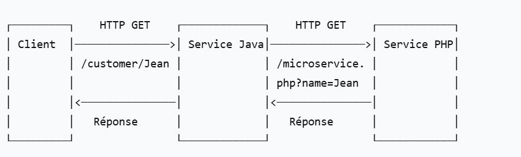
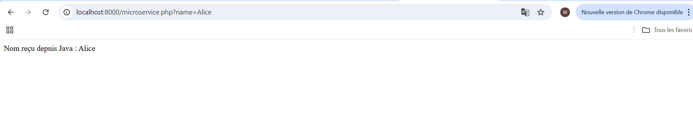
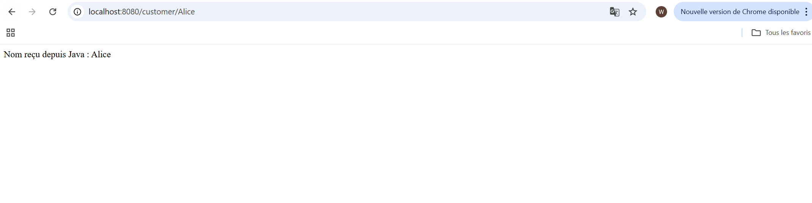

# Service de Communication Java/PHP

## Description

Ce projet illustre la communication entre une application Java Spring Boot et un microservice PHP via une API REST. L'application Java expose un endpoint qui transmet des données à un service PHP et retourne sa réponse.

## Service java

Le service Java, développé avec le framework Spring Boot, agit comme un contrôleur d'API REST qui reçoit les requêtes des clients. Il expose un endpoint `/customer/{name}` qui capture un nom fourni par l'utilisateur dans l'URL via le paramètre de chemin `{name}`.

Lorsqu'une requête est reçue, le contrôleur utilise RestTemplate, le client HTTP intégré de Spring, pour relayer ce nom vers le microservice PHP. Il construit dynamiquement l'URL du service PHP en concaténant l'URL de base configurée dans `application.properties` avec le chemin `/microservice.php?name={name}`. Le service inclut une gestion robuste des erreurs avec un bloc try-catch qui capture toute exception réseau ou de communication, affiche la stack trace complète dans la console pour le débogage, et retourne un message d'erreur clair à l'utilisateur final si l'appel échoue. La configuration externe via `@Value("${customer.service.url}")` permet une grande flexibilité pour changer l'emplacement du service PHP sans recompiler le code.

## Service php

Le service PHP fonctionne comme un microservice léger qui reçoit les requêtes du service Java via le paramètre GET `name`. Il vérifie d'abord si le paramètre est présent en utilisant la fonction `isset($_GET['name'])` pour éviter les erreurs de variable indéfinie.Le service formate ensuite une réponse textuelle claire indiquant "Nom reçu depuis Java : " suivi du nom sécurisé. Dans le cas où aucun paramètre n'est fourni, il retourne un message par défaut "Aucun nom reçu" pour maintenir une interface utilisateur cohérente. Ce service s'exécute typiquement sur un serveur web PHP séparé, permettant une architecture découplée et scalable.

## **Configuration Docker Compose**

Le fichier Docker Compose orchestre le déploiement des deux services en tant que conteneurs Docker indépendants. Il définit deux services : `rentalservice` pour l'application Java Spring Boot et `phpservice` pour le microservice PHP. Chaque service est construit à partir de son propre Dockerfile situé dans des répertoires distincts (`./RentalService` et `./PHPService`), permettant une séparation claire des dépendances et configurations. Les ports sont exposés avec un mappage explicite : le service Java écoute sur le port 8080 de l'hôte qui est redirigé vers le port 8080 du conteneur, tandis que le service PHP utilise le port 8000.

La directive `depends_on` établit une dépendance de démarrage où le service Java attend que le service PHP soit opérationnel avant de démarrer, garantissant que les appels réseau ne se produisent pas prématurément. La politique de redémarrage `unless-stopped` assure que les services relancent automatiquement en cas d'arrêt inattendu, améliorant la résilience de l'application. Le réseau utilise le driver `bridge` par défaut, créant un réseau isolé où les conteneurs peuvent communiquer entre eux via leurs noms de service (`phpservice`), ce qui permet au service Java d'accéder au service PHP en utilisant simplement `http://phpservice:8000` comme URL de service dans sa configuration, plutôt qu'une adresse IP externe.

## Démonstration

### Schéma:

### Test du service php:

### Test du service java:

